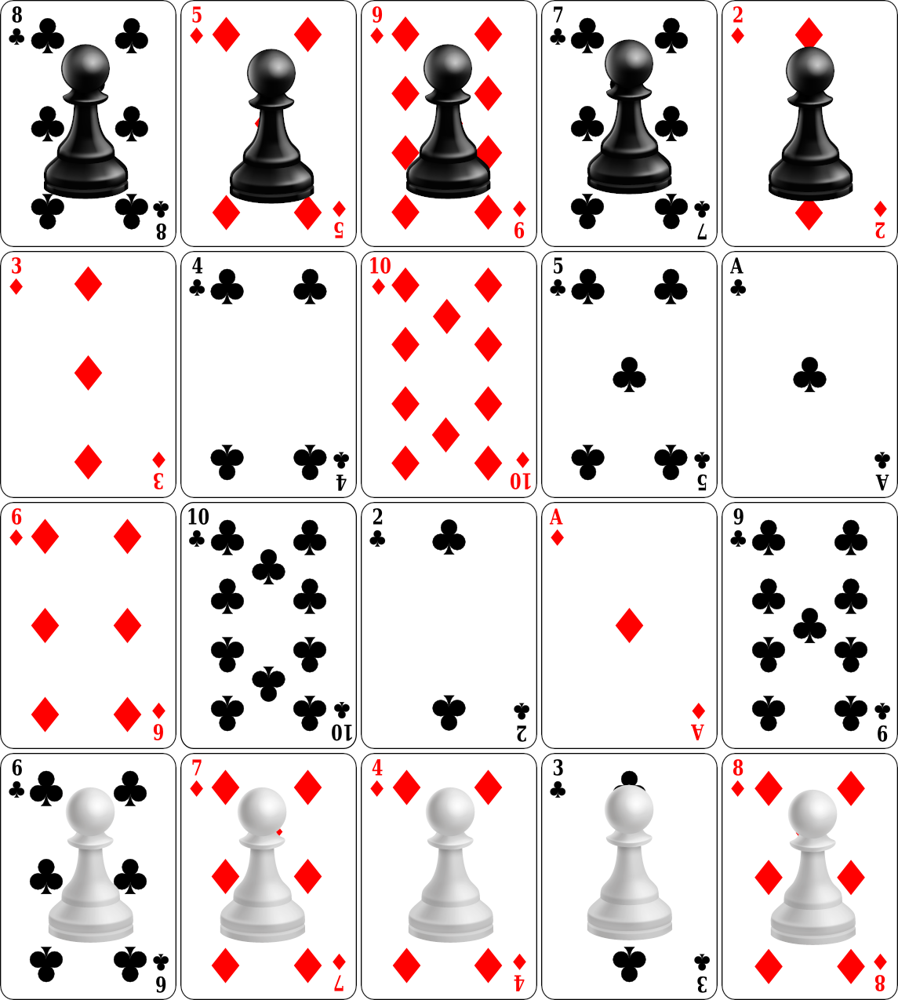

# Chimes at midnight
* Abstract strategy
* 2 players
* ?? minutes

## Introduction
**Chimes at midnight** is a cooperative abstract strategy game, where two players work together to beat the automated opponent.

## Rquired components
* 1 standard 52-card deck
* 10 pawns (5 white, 5 black)

## Setup
* Divide the deck of cards by suit and remove the court cards from all four suits. This will leave you with 40 numerical cards, from Ace to ten.
* Shuffle together one red with one black suit, and create a 4x5 grid of face-up cards with them. This will be the playing board, which will be different each time you play.
* Place the white pawns along one of the 5-card edges of the playing board. Place the black pawns along the other 5-cards edge. These are their starting lines.
* Take the two remaining suits of numerical cards and divide them among the two players: One player takes the odd black numbers and the even red numbers, while the other player takes the even black numbers and the odd red ones.
* Decide which player will choose the numbers to be played (we'll refer to them as player A), while the other player (player B) will determine the colour.

The following picture shows a possible initial setup for the game:

With this the setup is complete and the game can begin. Players control the white pawns while the automated opponent controls the black pawns.

## How to play
Through selecting cards from their decks, players choose what white pawn will move. Also, based on the information on the cards, the automated opponent will take their action too. Players cannot discuss strategy or agree on which will be the next action to take, and their part of the decision need to be done independently from one each other. A turn in the game is as follows:

1. Each player selects one of their cards and places it face down on the table. Then, both cards are revealed at the same time.
2. If both cards are the same colour or the same number, the automated opponent moves first, and the following steps 3. and 4. are played in reverse order (i.e. first step 4., then 3.). Otherwise, the players move first (first step 3., then 4.).
3. Combine the number of the card played by player A and the colour of the card played by player B to get a coordinate on the board. If there is a pawn on the card, it will move (even if it's a black pawn). If there are no pawns on it, nothing happens.
4. Combine the colour of the card played by player A and the number of the card played by player B to get a coordinate on the board. If there is a black pawn on that card, it will move. If there are no black pawns on it, nothing happens.
5. Each player adds the card played by the other player to their hand, and the turn finishes.

### Pawn movement
* If there are no other pawns in any of the eight spaces surrounding the pawn's current space, it will move one space forward towards the opponent's starting line.
* If there is one or more opposing pawns surrounding the pawn to move, capture is enforced. If there is only one opposing pawn, the moving pawn occupies that space (even if that means going backwards) and the opposing pawn is removed from the game. If several opposing pawns are around the moving pawn, capture the pawn on the tile with the highest number. If there are two pawns on tiles with the same highest number, capture the pawn on the tile with the highest number and opposite colour than the one the pawn is currently on.
* If no capture is possible but there is a pawn of the same colour blocking the move described above for the pawn to move, the pawn to move moves forward diagonally. If both diagonals are available, move the pawn to the destination tile with the highest number. If both numbers are the same, move it to the opposite colour than the pawn is currently on. If both diagonals are occupied by pawns of the same colour, the pawn does not move.

## End of the game

The winner of the game is whoever meets one of the following two criteria:
* One of their pawns reaches the starting line of the opponent, or
* The opponent is left with just one single pawn.

## Possible changes based on feedback
The following items describe changes to the rules or the gameplay based on feedback received from testers. The changes are either \[F]ixes to the rules or \[V]ariants to the game:

\[V] Test if, instead on deciding which player selects colour, who decides colour is based on who has the red Ace in their hand. When the Ace changes hands, the colour/number decison making changes too.
